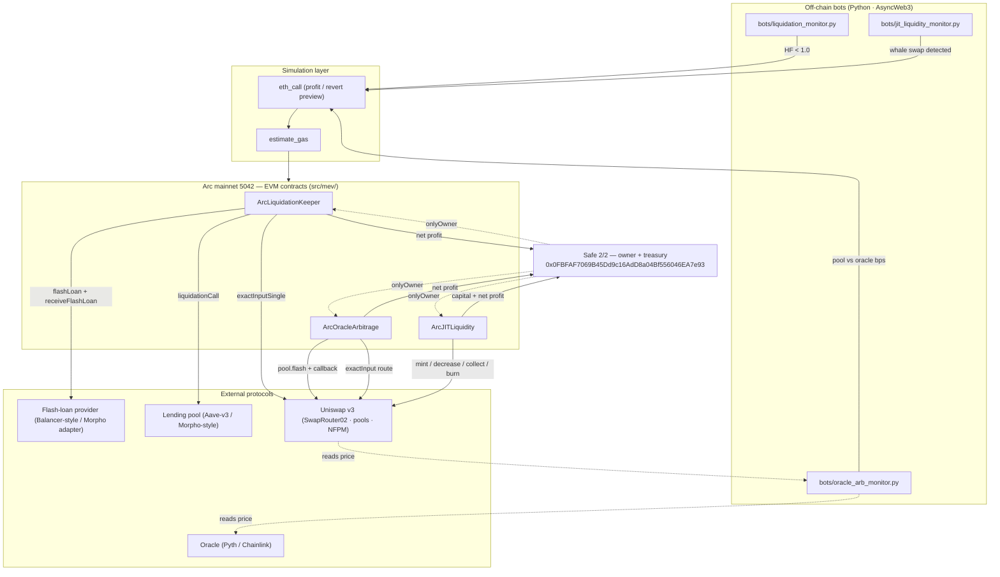

# MEV Suite — Overview

> Executive overview of the three MEV modules shipped in this repo, their architecture, the atomic
> invariants they enforce, and their risk model. Prepared for the Circle / Arc ecosystem review.
>
> **Status: drafted, unit-tested in CI, NOT audited, NOT deployed.** The modules are isolated under
> `contracts/src/mev/`, `contracts/test/mev/` and `bots/`.

## 1 · Executive summary

The suite is three **capital-efficient, atomic** strategies for Arc mainnet (chain 5042). Each one either
succeeds and pays a **net profit to the owner Safe** (`0x0FBFAF7069B45Dd9c16AdD8a04Bf556046EA7e93`), or
**reverts** — no partial execution, no capital stranded.

| Module | Strategy | Capital model | Contract |
|---|---|---|---|
| **1 · Liquidations** | Repay insolvent borrowers, seize the discounted collateral, swap it back | **Flash loan** (USDC) | `ArcLiquidationKeeper.sol` |
| **2 · Oracle arbitrage** | Trade a pool that lags its oracle feed along a misaligned route | **Flash loan** (Uniswap v3) | `ArcOracleArbitrage.sol` |
| **3 · JIT liquidity** | Mint a 1-tick position for one whale swap, capture the fee, burn it | Owner-provided capital | `ArcJITLiquidity.sol` |

Common guarantees across the suite:
- **Non-custodial**: funds only move inside the strategy and back to the owner Safe.
- **Atomic profit guard**: every strategy ends with `require(out >= in + costs + minProfit)`; otherwise revert.
- **`onlyOwner`** entrypoints, **`nonReentrant`** on the flash/JIT callbacks, **`emergencyWithdraw`**.
- **Off-chain first**: bots simulate with `eth_call` + `estimate_gas` before ever broadcasting.

## 2 · Architecture

## 3 · Modules

### 3.1 · Liquidations (`ArcLiquidationKeeper` + `ArcMorphoLiquidator`)
- **Why**: borrowers whose **Health Factor < 1.0** can be liquidated for a bonus; this executes that with
  **no upfront capital**.
- **Two flavours:**
  - `ArcLiquidationKeeper` — Aave-v3-style pool + Balancer-style flash loan (generic).
  - **`ArcMorphoLiquidator` — Morpho Blue** (Arc mainnet `0x34CD04070dD72b14E241112F6d83812Df5Af7fCD`):
    Morpho's native **fee-free** `flashLoan` + `onMorphoFlashLoan` callback + `liquidate(MarketParams, …)`.
- **Flow (Morpho)**: `executeLiquidation` → `morpho.flashLoan(USDC)` → `onMorphoFlashLoan`:
  `morpho.liquidate` → Uniswap v3 `exactInputSingle` (collateral→USDC) → repay the flash loan → profit to owner.
- **Guard**: `USDC_balance >= flashAmount + minProfit`, else `InsufficientProfit` (Morpho flash loans are fee-free).
- **Bot**: `bots/mev_morpho_liquidator.py` reads `position(marketId, borrower)` + `market(marketId)` + the
  Morpho oracle, computes the **HF off-chain**, discovers borrowers from `Borrow` logs, simulates, alerts.

### 3.2 · Oracle arbitrage (`ArcOracleArbitrage`)
- **Why**: when a Uniswap v3 pool lags the oracle feed, a flash-loaned swap along a misaligned multi-hop
  route captures the gap.
- **Flow**: `executeArbitrage` → `pool.flash(USDC)` → `uniswapV3FlashCallback`:
  `SwapRouter02.exactInput(route)` (USDC→…→USDC) → repay the pool → profit to the owner.
- **Guard**: `received >= amountIn + flashFee + minProfit`, else `InsufficientProfit`.
- **Bot**: `oracle_arb_monitor.py` measures `slot0` vs oracle in bps and **ternary-searches the optimal
  input size** via `eth_call` (the contract returns the simulated profit).

### 3.3 · JIT liquidity (`ArcJITLiquidity`)
- **Why**: mint a **1-tick** position just before a whale swap so that swap pays the fee to our position,
  then remove + burn atomically.
- **Flow**: `executeJIT` → range check → `NFPM.mint` → optional target swap → `decreaseLiquidity` →
  `collect` → `burn` → value check → return capital + profit to the owner.
- **Guard**: `endValue >= startValue + gasCost + minProfit`, else `InsufficientProfit`; plus
  `TickOutOfRange` if the range doesn't bracket the current tick.
- **Bot**: `jit_liquidity_monitor.py` watches `Swap` events, computes the 1-tick range, simulates, alerts.

## 4 · Risk & invariants matrix

| Module | Atomic invariant (enforced on-chain) | Key risks | Mitigation in code |
|---|---|---|---|
| Liquidations | `usdc >= debt + flashFee + minProfit` | flash fee; swap slippage; stale bonus; competition | strict profit check → revert; `swapFee` param; `minProfit`; `nonReentrant` |
| Oracle arb | `received >= amountIn + flashFee + minProfit` | oracle staleness/manipulation; route liquidity; flash fee | profit check → revert; off-chain oracle vs pool bps + `THRESHOLD_BPS`; `minProfit` |
| JIT liquidity | `endValue >= startValue + gasCost + minProfit` and `tick ∈ [lower, upper)` | impermanent loss / swap crosses range; tick misalignment; gas | value guard → revert; `TickOutOfRange`; `gasCost` param; `nonReentrant` |
| All | owner-only entrypoints; no funds held at rest | reentrancy; stuck tokens; key compromise | `onlyOwner`; `nonReentrant` callbacks; `emergencyWithdraw`; Safe owner (2/2) |

## 5 · Testing & CI

- **86 Foundry tests** total, of which **15 are the MEV suite** (6 liquidations · 4 oracle-arb · 5 JIT),
  run by the GitHub Actions `forge test` job on every push.
- Mocks cover the full atomic lifecycles, including the **mandatory-revert** cases and access control.
- The Python bots are not executed by CI (they need live RPC/oracle addresses); they are import-safe and
  fully configurable via `bots/.env`.

## 6 · Status & next steps

| | |
|---|---|
| Done | 3 contracts + Foundry tests + Python monitors + docs, **CI green** |
| Not done | audit, mainnet deploy, real oracle/pool/provider addresses |
| Blocked by | real **flash-loan provider** on Arc (Morpho adapter), a **lending pool** to watch, a live **oracle** feed, and a **bundler/ordering path** for JIT |
| Next | see [`PRODUCTION_CHECKLIST.md`](PRODUCTION_CHECKLIST.md) |

> **Note on Arc MEV:** Arc runs a **permissioned validator set with no public mempool in the Ethereum
> sense**, so classic searcher MEV (backrunning/sandwich/JIT) is structurally limited. These modules are
> designed to be **parameterized and deployed** when the ecosystem provides a bundler or ordering path;
> until then they serve as a rigorous, CI-verified reference implementation.
